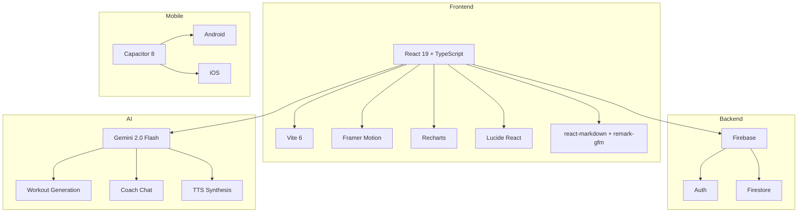

<div align="center">
  <h1>NAAN THANDA LEO</h1>
  <h3>Elite AI Fitness Commander</h3>
</div>

<p align="center">
  
  
  
  
  
  
  
  <br/>
  <a href="#features">Features</a> •
  <a href="docs/ARCHITECTURE.md">Architecture</a> •
  <a href="docs/TESTING.md">Testing</a> •
  <a href="docs/DEPLOYMENT.md">Deployment</a> •
  <a href="docs/CONTRIBUTING.md">Contributing</a>
</p>

---

## Overview

**Naan Thanda Leo** is a full-stack, AI-driven fitness application that delivers hyper-personalized workout and nutrition plans. Built with **React 19**, **TypeScript**, **Firebase**, and **Google Gemini 2.0**, it adapts to each user's biometrics, injuries, equipment, and goals in real time.

This project serves as a **B.Tech capstone** demonstrating modern full-stack engineering — from real-time AI streaming and gamification to adaptive training analytics and cross-platform mobile deployment via Capacitor.

---

## Features

| Module | Highlights |
|--------|------------|
| **AI Workout Generator** | Gemini 2.0 generates periodized, injury-aware plans with exercise images |
| **AI Coach (Chat)** | Real-time streaming chat with full user context awareness + TTS voice synthesis |
| **Dashboard** | Workout/nutrition streaks, daily briefing, gamified XP & level system |
| **Nutrition Tracker** | Macro logging with personalized daily goals (BMR + TDEE based) |
| **Progress Tracking** | Weight, body fat, circumference measurements with Recharts visualizations |
| **Smart Analytics** | Weekly/monthly insight reports, period-over-period comparison, JSON export |
| **Gamification** | 8 achievement badges, weekly challenges, monthly milestones |
| **Calendar View** | Visual workout, log, nutrition, and progress calendar |
| **Adaptive Training** | Fatigue trends, weakest muscle detection, volume/intensity adjustments |

---

## Tech Stack



| Category | Technology | Purpose |
|----------|-----------|---------|
| **Framework** | React 19, TypeScript 5.8 | UI with strict typing |
| **Build** | Vite 6 | Fast dev server & optimized production builds |
| **Backend** | Firebase Auth + Firestore | Authentication, user data, NoSQL storage |
| **AI** | Google Gemini 2.0 Flash | Workout generation, coaching chat, speech |
| **Animation** | Framer Motion | UI transitions, micro-interactions |
| **Charts** | Recharts | Weight trends, muscle group analysis |
| **Mobile** | Capacitor 8 | Native Android/iOS deployment |
| **Testing** | Vitest + Testing Library | Unit & integration tests |
| **CI/CD** | GitHub Actions | Lint, typecheck, test, build, Firebase deploy |

---

## Quick Start

### Prerequisites

- Node.js 20+
- A [Google Gemini API key](https://aistudio.google.com/app/apikey)

### Installation

```bash
git clone https://github.com/your-org/naan-thanda-leo.git
cd naan-thanda-leo/public

# Install dependencies
npm install

# Configure environment (copy and fill in)
cp .env.example .env.local
# Edit .env.local with your Gemini API key

# Start development server
npm run dev
```

Open `http://localhost:3000` in your browser.

---

## Project Structure

```
public/
├── App.tsx                        # Root component with routing & state
├── index.tsx                      # Entry point
├── types.ts                       # All TypeScript interfaces & enums
├── components/
│   ├── Login.tsx                  # Email/password authentication
│   ├── SignUp.tsx                 # User registration
│   ├── ForgotPassword.tsx         # Password reset
│   ├── OnboardingFlow.tsx         # Multi-step profile setup
│   ├── Dashboard.tsx              # Home screen with streaks & stats
│   ├── WorkoutView.tsx            # AI plan display, timer, session logging
│   ├── Nutrition.tsx              # Macro tracking, entry CRUD
│   ├── Progress.tsx               # Weight/measurements logs & charts
│   ├── Achievements.tsx           # Badge display & gamification
│   ├── AICoach.tsx                # Chat interface with streaming AI
│   ├── Analytics.tsx              # Insight reports & comparisons
│   ├── CalendarView.tsx           # Monthly activity calendar
│   ├── ExportCenter.tsx           # Data export (JSON)
│   ├── Notepad.tsx                # Training journal
│   ├── WorkoutChart.tsx           # Reusable Recharts wrapper
│   ├── IntroAnimation.tsx         # Splash animation
│   └── __tests__/                 # Component test files
├── services/
│   ├── firebase.ts                # Firebase init & config
│   ├── AuthContext.tsx            # Auth state provider
│   ├── firestoreService.ts        # Firestore CRUD abstraction
│   ├── geminiService.ts           # Gemini API integration
│   ├── contextBuilderService.ts   # AI context assembly
│   ├── adaptiveTrainingService.ts # Analytics & insights engine
│   ├── gamificationService.ts     # Streaks, XP, badges logic
│   └── __tests__/                 # Service test files
├── docs/                          # Documentation
├── .github/workflows/             # CI/CD pipeline
└── dist/                          # Production build output
```

---

## Documentation

| Document | Description |
|----------|-------------|
| [Architecture](docs/ARCHITECTURE.md) | Component tree, data flow, route design, Mermaid diagrams |
| [Firebase Setup](docs/FIREBASE_SETUP.md) | Firestore schema, security rules, auth configuration |
| [AI Workflow](docs/AI_WORKFLOW.md) | Gemini integration, prompt engineering, streaming, TTS |
| [Testing](docs/TESTING.md) | Test strategy, mock patterns, running & writing tests |
| [Deployment](docs/DEPLOYMENT.md) | Firebase Hosting, Capacitor mobile, environment variables |
| [Contributing](docs/CONTRIBUTING.md) | PR workflow, code style, commit conventions |
| [Troubleshooting](docs/TROUBLESHOOTING.md) | Common issues, Firebase errors, build failures |

---

## License

Distributed under the MIT License.
