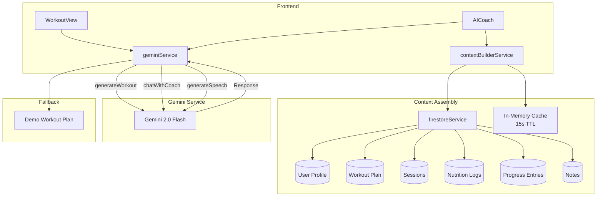
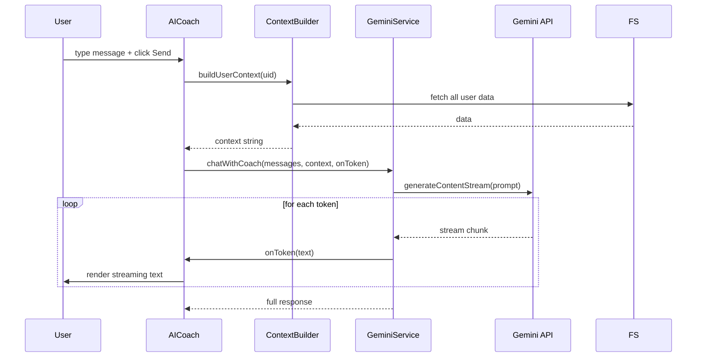

# AI Workflow

## Architecture



## Workout Generation

`geminiService.ts:generateWorkout(profile)` sends a structured prompt to Gemini 2.0 Flash:

### Prompt Engineering

The prompt is built from the user's profile fields:

```
You are an elite strength and conditioning coach "Leo". Create a high-intensity,
structured workout plan for a user with the following profile:

User Profile:
- Age: {age}
- Gender: {gender}
- Weight: {weight}kg
- Height: {height}cm
- Experience: {experience}
- Goal: {goal}
- Days Available: {daysAvailable}
- Equipment Access: {equipment}
- Injuries/Limitations: {injuries}
- Preferred Split: {splitPreference}

Requirements:
- Create a {daysAvailable}-day workout split
- Each day: 5-7 exercises with sets, reps, rest, muscle groups, recommended weights
- Consider equipment limitations and injuries
- Progressive structure: compound → isolation
- Include form cues and safety notes

Return ONLY valid JSON in this exact format:
{... WorkoutPlan schema ...}
```

### Response Processing

1. Raw response is trimmed and cleaned (markdown code fences removed)
2. Parsed with `JSON.parse()`
3. Validated for required fields (`splitName`, `description`, `schedule`)
4. Each exercise is enriched with a demonstration image URL via `addExerciseImages()`
5. `generatedAt: Date.now()` is appended

### Fallback Plan

If the API call fails (network error, invalid response, API key not configured), a hardcoded **demo workout plan** is returned with realistic 3-day Push/Pull/Legs split containing 18 exercises with detailed instructions. This ensures the application remains functional without an API key.

---

## AI Coach Chat

`geminiService.ts:chatWithCoach(messages, context, onToken)` implements real-time streaming:



### Key implementation details:

- **Model**: `gemini-2.0-flash-exp` (low latency for real-time chat)
- **Generation config**: temperature: 0.7, topK: 40, topP: 0.95, maxOutputTokens: 8192
- **System prompt**: Leo is an "elite strength and conditioning coach" with strict persona rules (aggressive, direct, no disclaimers)
- **Context injection**: The `contextBuilderService` assembles a structured text block with:
  - User biometrics & profile
  - Current workout plan
  - Last 10 workout sessions
  - Last 7 days nutrition
  - Latest progress measurements
  - Journal notes & coach notepad
- **Context caching**: Built context is cached in memory for 15 seconds to avoid redundant Firestore reads

---

## Text-to-Speech

`geminiService.ts:generateSpeech(text)` uses Gemini's built-in TTS capability:

1. Sends text to Gemini with a "generate speech audio" instruction
2. Receives base64-encoded PCM audio data in the response
3. Audio is decoded and played via `AudioContext` / `webkitAudioContext` in the browser
4. Returns `{ audioData: string }` with the base64 PCM data

---

## Adaptive Training Analytics

`adaptiveTrainingService.ts` is a client-side analytics engine (not AI-powered):

| Metric | Calculation |
|--------|-------------|
| **Consistency Score** | Ratio of completed to scheduled workouts over time |
| **Fatigue Trend** | Average intensity ratings over last 7 sessions |
| **Missed Sessions** | Count of non-completed workout days in logs |
| **Performance Trend** | Average performance ratings over time |
| **Weakest Muscle Groups** | Frequency analysis of exercises by muscle group |

### Insight Reports

`generateInsightReport(period)` produces weekly or monthly summaries:
- Total workouts, calories burned
- Average protein intake
- Consistency score
- Best performing workout day
- Weakest muscle group
- Adherence rate
- Weight change trend
- Strength progress trend

### Period Comparisons

`getComparison()` compares the current period against the previous period across:
- Workout count
- Calorie burn
- Average weight
- Consistency score

Differences are calculated as absolute changes between periods.
