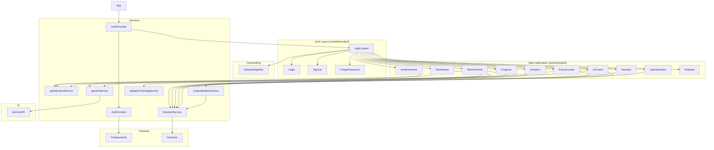
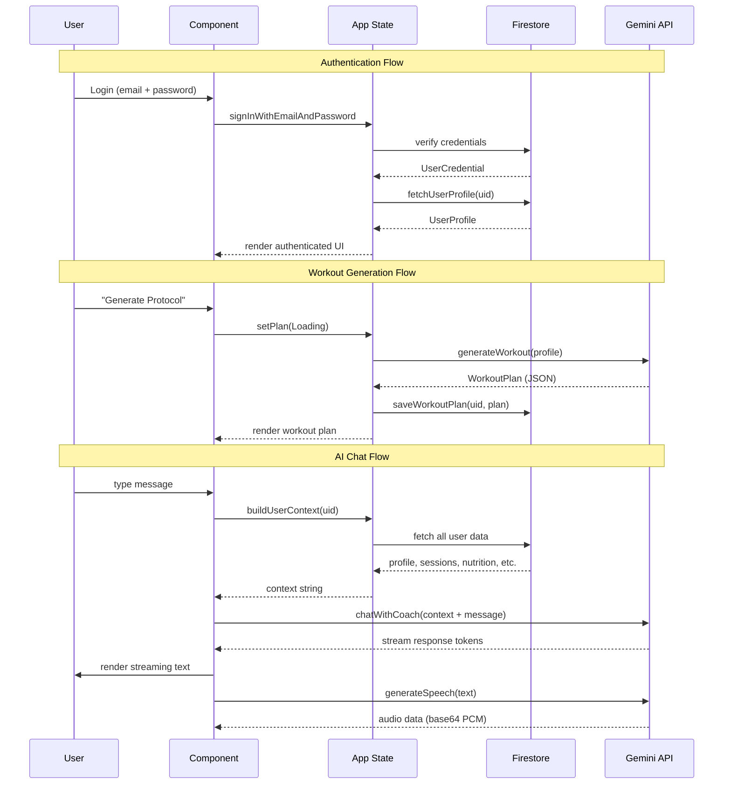

# Architecture

## Component Tree



## Data Flow



## Routing Architecture

This application uses a **single-page architecture** without a traditional router. State-based view switching is managed in `App.tsx` via a `view` state variable:

```typescript
const [view, setView] = useState<
  'dashboard' | 'workout' | 'nutrition' | 'coach' | 'analytics' |
  'notepad' | 'progress' | 'achievements' | 'calendar' | 'export'
>('dashboard');
```

Each view corresponds to a lazy-loaded component:

```
Auth Gate (no user)    → Login / SignUp / ForgotPassword
Authenticated, no OB   → OnboardingFlow
Authenticated + OB     → Nav Sidebar + Main Content Area
  ├── dashboard  → Dashboard
  ├── workout    → WorkoutView
  ├── nutrition  → Nutrition
  ├── coach      → AICoach
  ├── progress   → Progress
  ├── analytics  → Analytics
  ├── achievements → Achievements
  ├── notepad    → Notepad
  ├── calendar   → CalendarView
  └── export     → ExportCenter
```

## State Management

State is managed at three levels:

| Level | Mechanism | Scope |
|-------|-----------|-------|
| **Auth** | React Context (`AuthContext`) | Current user, profile, auth actions |
| **App** | `useState` in `AppContent` | Workout plan, sessions, logs, nutrition, notes, progress |
| **Component** | Local `useState` | UI state (modals, forms, tabs, loading indicators) |

Data flows **top-down** via props from `AppContent` to child components. Updates flow **bottom-up** via callback props (`onUpdateEntries`, `handleSetPlan`, etc.) that persist to Firestore and update local state.

## Key Design Decisions

1. **State-based routing over React Router** — avoids context switching and keeps all state in one tree. Works well for a dashboard-style SPA with 10 views.

2. **Lazy-loaded components** — each view is a `React.lazy()` import, split into separate chunks by Vite.

3. **Firestore as single source of truth** — all user data is fetched on login and cached in app state. Mutations write to Firestore first, then update local state.

4. **localStorage fallback** — all data is also persisted locally as a fallback when Firestore is unavailable or during development.

5. **Field normalization** — `firestoreService` handles field name mapping between old/new schemas (e.g., `name` ↔ `fullName`, `goal` ↔ `fitnessGoal`, `completedOnboarding` ↔ `onboardingCompleted`).
