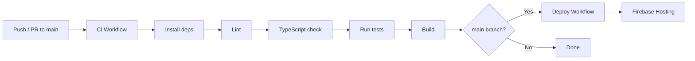

# Deployment Guide

## Prerequisites

- Node.js 20+
- Firebase CLI (`npm install -g firebase-tools`)
- A Firebase project with Authentication and Firestore enabled
- A Google Gemini API key

---

## Environment Variables

Copy `.env.example` to `.env.local` and fill in the values:

```env
VITE_GEMINI_API_KEY=your_gemini_api_key
```

Optional Firebase overrides (defaults to `leo-fitness-c0aa7` development project):

```env
VITE_FIREBASE_API_KEY=
VITE_FIREBASE_AUTH_DOMAIN=
VITE_FIREBASE_PROJECT_ID=
VITE_FIREBASE_STORAGE_BUCKET=
VITE_FIREBASE_MESSAGING_SENDER_ID=
VITE_FIREBASE_APP_ID=
VITE_FIREBASE_MEASUREMENT_ID=
```

> **Important**: `VITE_GEMINI_API_KEY` is required for AI features. Without it, the application falls back to demo data.

---

## Build

```bash
cd public
npm run build
```

Output: `public/dist/` — optimized production bundle with code-split chunks:

```
dist/
├── index.html
├── assets/
│   ├── index-{hash}.js        (main app bundle)
│   ├── vendor-firebase-{hash}.js
│   ├── vendor-framer-{hash}.js
│   ├── vendor-lucide-{hash}.js
│   ├── vendor-recharts-{hash}.js
│   └── index-{hash}.css
```

---

## Firebase Hosting

### Manual Deploy

```bash
# Login to Firebase
firebase login

# Deploy to Firebase Hosting
firebase deploy --only hosting

# Preview on a temporary channel
firebase hosting:channel:deploy preview-name
```

### Configuration (`firebase.json`)

```json
{
  "hosting": {
    "public": "dist",
    "ignore": ["firebase.json", "**/.*", "**/node_modules/**"],
    "rewrites": [
      { "source": "**", "destination": "/index.html" }
    ]
  }
}
```

The rewrite rule ensures that all routes return `index.html` (SPA behavior).

### CI/CD Deploy

The project includes a GitHub Actions workflow (`.github/workflows/deploy.yml`) that:

1. Triggers automatically when the **CI** workflow succeeds on `main`
2. Can also be triggered manually via `workflow_dispatch`
3. Builds the application and deploys to Firebase Hosting live channel

**Required GitHub Secrets:**

| Secret | Value |
|--------|-------|
| `GEMINI_API_KEY` | The Gemini API key from `.env.local` |
| `FIREBASE_SERVICE_ACCOUNT_LEO_FITNESS_C0AA7` | Firebase service account JSON |

**To generate the service account JSON:**
1. Go to [Firebase Console → Project Settings → Service Accounts](https://console.firebase.google.com/project/leo-fitness-c0aa7/settings/serviceaccounts/adminsdk)
2. Click "Generate New Private Key"
3. Copy the entire JSON output and save it as the `FIREBASE_SERVICE_ACCOUNT_LEO_FITNESS_C0AA7` secret in your GitHub repository settings

---

## Mobile Deployment (Capacitor)

### Android

```bash
# Build the web app
npm run build

# Sync Capacitor with the build
npx cap sync android

# Open in Android Studio for deployment
npx cap open android
```

### iOS

```bash
npm run build
npx cap sync ios
npx cap open ios
```

### Configuration (`capacitor.config.ts`)

```typescript
import { CapacitorConfig } from '@capacitor/cli';

const config: CapacitorConfig = {
  appId: 'com.naan.thanda.leo',
  appName: 'Leo AI',
  webDir: 'dist',
  server: {
    androidScheme: 'https',
  },
};

export default config;
```

---

## CI/CD Pipeline



The CI workflow runs on every push and PR. Deployment only triggers after CI passes on `main`.

---

## Environment-Specific Builds

The same build serves all environments. Environment-specific configuration (Firebase project, API keys) is determined by environment variables at build time. For different environments (dev, staging, prod), use different `.env` files:

```bash
# Development
cp .env.example .env.local

# Production (CI)
# Set VITE_GEMINI_API_KEY as a CI secret
```
